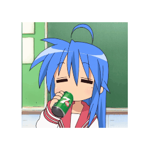

# Me
Hello I'm Abby.

# About Me
- I am terminally online and mentally ill.
- My main language is Java Script and HTML but I also know: Python, C#, a small amount of C++, a small amount of ASM and a small amount of java/kotlin.
- My hobbies are: AI, Archival, Beta/Alpha/Debug software and games, playing with cutting edge tech, Selfhosting, and reverse engineering.
- I would like to know much more C++ and learn rust but I'm extremely lazy.

# My Projects
### [Abby's Microsoft Activation](https://github.com/Dreachu/AMA)

This is the main project which I worked on solo

# Future Projects
Yeah man idk, right now I'm just trying to get a job. I code as a hobby so if something I find interesting comes up I'll probably work on it.

